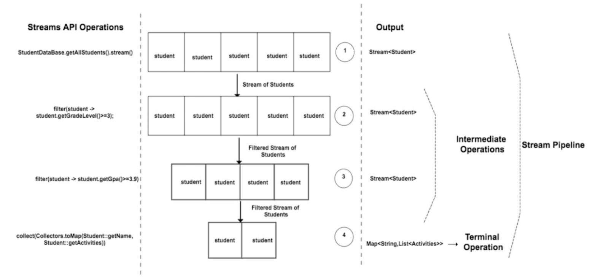
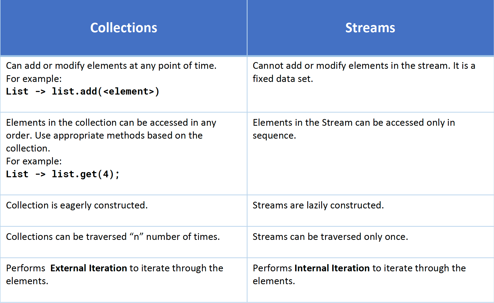
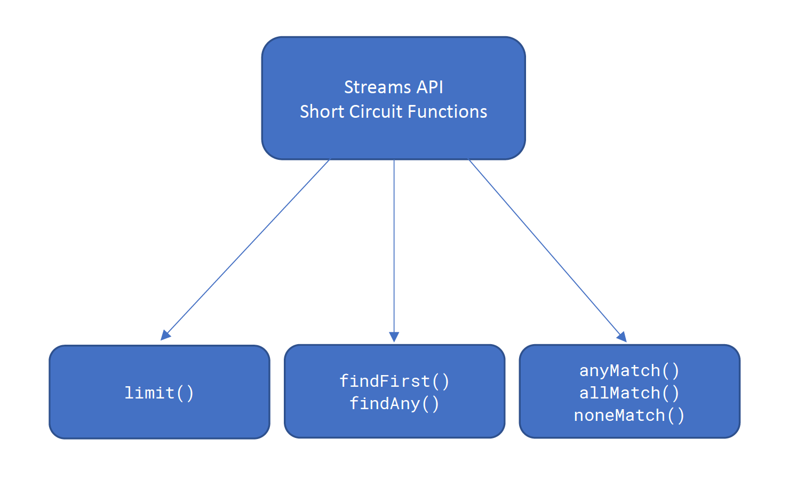
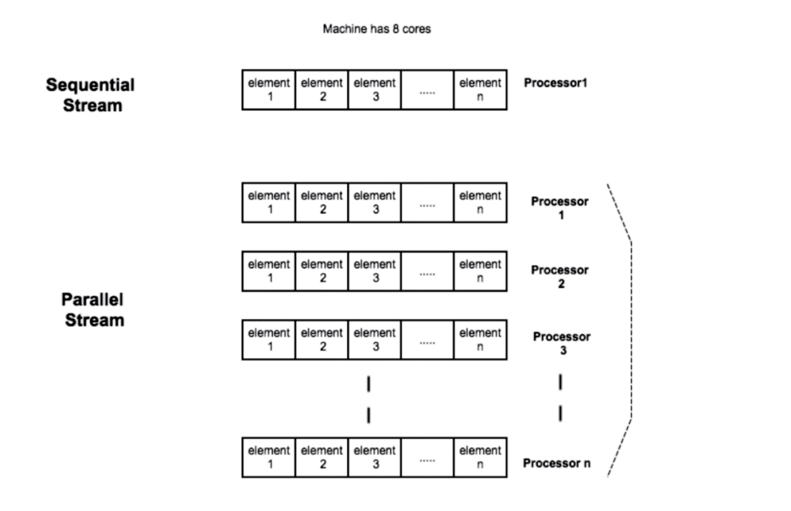

Java 8 Features
====================
- [Introduction](#introduction)
- [Lambda](#lambda)
- [Functional Interface](#functional-interface)
- [Method Reference](#method-reference)
- [Constructor Reference](#constructor-reference)
- [Streams](#streams)
  - [How Stream API Works](#how-stream-api-works)
  - [Collections Vs Streams](#collections-vs-streams)
  - [Debugging Streams](#debugging-streams)
  - [Intermediate Operations](#intermediate-operations)
  - [Short Circuiting](#short-circuiting)
  - [Factory Methods](#factory-methods)
  - [Numeric Streams](#numeric-streams)
  - [Parallel Streams](#parallel-streams)
  - [How Parallel Stream Works](#how-parallel-stream-works)
- [Optional](#optional)
- [Default and Static Method in Interfaces](#default-and-static-method-in-interfaces)

<br><br>


## Introduction
### Imperative vs Declarative Programming

### Examples
* [ImperativeVsDeclarativeExample1](src/main/java/org/example/java/ImperativeVsDeclarativeExample1.java)
* [ImperativeVsDeclarativeExample2](src/main/java/org/example/java/ImperativeVsDeclarativeExample2.java)

<br><br>


## Lambda
  - is equivalent to a function (method) without a name
  - referred to as **Anonymous functions**
  - are not tied to any class like a regular method
  - can be assigned to a variable and passed around

### Syntax
```
  ()           ->          {}
  lambda       arrow       lambda
  input                    body
  parameters
```
Sample Representation
```
Function<String, String> someString = (name) -> name.toUpperCase().concat("default");
           |        |                        |
         input    output               lambda expression
```

### Usage
  - mainly used to implement Functional Interfaces

### Local Variables
  - not allowed to use the same local variable name as **lambda parameters** or inside the **lambda body**
  - not allowed to **re-assign** a value to a local variable

### Instance Variables
  - no restrictions on **instance** variables

### Examples
* [ComparatorLambdaExample](src/main/java/org/example/java/lambda/ComparatorLambdaExample.java)
* [RunnableLambdaExample](src/main/java/org/example/java/lambda/RunnableLambdaExample.java)
* [LambdaLocalVariableExample](src/main/java/org/example/java/lambda/LambdaLocalVariableExample.java)
* [LambdaInstanceVariableExample](src/main/java/org/example/java/lambda/LambdaInstanceVariableExample.java)

<br><br>


## Functional Interface
  * also called as Single Abstract Method Interfaces (SAM)
  * is an interface that has exactly one abstract method
  * **@FunctionalInterface** annotation

Some examples of Functional Interface
  * `java.util.Comparator`
  * `java.lang.Runnable`
```
@FunctionalInterface
public interface Comparator<T> {
  int compare(T o1, T o2);
}

@FunctionalInterface
public interface Runnable {
  public abstract void run();
}
```

### Primary Interfaces

> **<!>** All new functional interfaces are available at `java.util.function` package

| Interface      | Extension Interface
|----------------|---------------------
| Consumer       | BiConsumer
| Predicate      | BiPredicate
| Function       | BiFunction, UnaryOperator, BinaryOperator
| Supplier       |

### Examples
* [ConsumerExample](src/main/java/org/example/java/functionalinterface/ConsumerExample.java)
* [ConsumerStudentExample](src/main/java/org/example/java/functionalinterface/ConsumerStudentExample.java)
* [BiConsumerExample](src/main/java/org/example/java/functionalinterface/BiConsumerExample.java)
* [BiConsumerStudentExample](src/main/java/org/example/java/functionalinterface/BiConsumerStudentExample.java)
* [PredicateExample](src/main/java/org/example/java/functionalinterface/PredicateExample.java)
* [PredicateStudentExample](src/main/java/org/example/java/functionalinterface/PredicateStudentExample.java)
* [PredicateAndConsumerExample](src/main/java/org/example/java/functionalinterface/PredicateAndConsumerExample.java)
* [BiPredicateExample](src/main/java/org/example/java/functionalinterface/BiPredicateExample.java)
* [BiPredicateStudentExample](src/main/java/org/example/java/functionalinterface/BiPredicateStudentExample.java)
* [FunctionExample](src/main/java/org/example/java/functionalinterface/FunctionExample.java)
* [FunctionStudentExample](src/main/java/org/example/java/functionalinterface/FunctionStudentExample.java)
* [BiFunctionExample](src/main/java/org/example/java/functionalinterface/BiFunctionExample.java)
* [BiFunctionStudentExample](src/main/java/org/example/java/functionalinterface/BiFunctionStudentExample.java)
* [UnaryOperatorExample](src/main/java/org/example/java/functionalinterface/UnaryOperatorExample.java)
* [BinaryOperatorExample](src/main/java/org/example/java/functionalinterface/BinaryOperatorExample.java)
* [SupplierExample](src/main/java/org/example/java/functionalinterface/SupplierExample.java)
* [SupplierStudentExample](src/main/java/org/example/java/functionalinterface/SupplierStudentExample.java)

<br><br>


## Method Reference
  - simpify the implementation of Functional Interfaces
  - shortcut for writing the Lambda Expressions
  - refer a method in a class

### Syntax
```
  ClassName::instance-methodName
  ClassName::static-methodName
  Instance::methodName
```

### Usage
  - Lambda expressions referring to a method directly.

```
  Using Lambda:
    Function<String, String> toUpperCase = (s) -> s.toUpperCase();

  Using Method Reference:
    Function<String, String> toUpperCase = String::toUpperCase();
```

### Examples
* [MethodReferenceExample](src/main/java/org/example/java/methodreference/MethodReferenceExample.java)
* [ConsumerMethodReferenceExample](src/main/java/org/example/java/methodreference/ConsumerMethodReferenceExample.java)

<br><br>


## Constructor Reference

### Syntax
```
  ClassName::new
```

### Usage
  - class should have empty constructor

```
  Correct:
    Supplier<Student> studentSupplier = Student::new;

  Invalid:
    Student student = Student::new;
```

### Examples
* [ConstructorReferenceExample](src/main/java/org/example/java/constructorreference/ConstructorReferenceExample.java)

<br><br>


## Streams
  - Stream is a sequence of elements which can be treated out of a collections such as `List` or `Arrays` or any kind of `I/O` resources and etc.

### Streams API
  - perform some operation on Collections
  - parallel operations are easy to perform without having to spawn multiple threads
  - can be used with arrays or any kind of I/O
  - stream operations can be performed either sequentially or parallel.

### Usage
```
  List<String> names = Arrays.asList("adam", "dan", "jenny");
  names.stream();           // creates a stream
  names.parallelStream();   // creates a parallel stream
```

### How Stream API Works


### Collections Vs Streams


### Debugging Streams
  - using `.stream().peek()`
```
  List<String> names = Arrays.asList("adam", "dan", "jenny");
  names.stream().peek((name) ->
    {
      System.out.println(name);
    });
```

### Examples
* [StreamsExample](src/main/java/org/example/java/streams/StreamsExample.java)
* [StreamsStudentExample](src/main/java/org/example/java/streams/StreamsStudentExample.java)
* [CollectionsVsStreams](src/main/java/org/example/java/streams/CollectionsVsStreams.java)
* [StreamsDebuggingExample](src/main/java/org/example/java/streams/StreamsDebuggingExample.java)

### Intermediate Operations

#### map()
  - Convert(transform) one type to another
  - Don't get confused this with Map Collection
  - eg.
[StreamsMapExample](src/main/java/org/example/java/streams/StreamsMapExample.java)

#### flatMap()
  - Convert(transform) one type to another as like `map()` method
  - Used in the context of Stream where each element in the stream represents multiple elements.
      ```
      Stream<List>, Stream<Array>
      ```
  - eg.
[StreamsFlatMapExample](src/main/java/org/example/java/streams/StreamsFlatMapExample.java)

#### distinct()
  - Returns a stream with unique elements
  - eg.
[StreamsDistinctMapExample](src/main/java/org/example/java/streams/StreamsDistinctMapExample.java)

#### sorted()
  - Sort the elements in the stream
  - eg.
[StreamsSortedExample](src/main/java/org/example/java/streams/StreamsSortedExample.java)
, [StreamsComparatorExample](src/main/java/org/example/java/streams/StreamsComparatorExample.java)

#### filter()
  - Filters the elements in the stream
  - Input to the filter is a **Predicate** Functional Interface
  - eg.
[StreamsFilterExample](src/main/java/org/example/java/streams/StreamsFilterExample.java)

#### limit()
  - Limits the **"n"** number of elements to be processed in the stream
  - eg.
[StreamsLimitExample](src/main/java/org/example/java/streams/StreamsLimitExample.java)

#### skip()
  - Skips the **"n"** number of elements from the stream
  - eg.
[StreamsSkipExample](src/main/java/org/example/java/streams/StreamsSkipExample.java)

### Terminal Operations
  - collects data
  - starts the whole stream pipeline

#### count()
  - Returns a long with the total no of elements in the stream
  - eg.
[StreamsCountExample](src/main/java/org/example/java/streams/StreamsCountExample.java)

#### reduce()
  - Used to reduce the contents of a stream to a single value
  - This is a **terminal operation**
  - It takes two parameters as an input
    - **First parameter**   - default or initial value
    - **Second parameter**  - `BinaryOperator<T> (extends BiFunction<T, T, T>)`
  - eg.
[StreamsReduceExample](src/main/java/org/example/java/streams/StreamsReduceExample.java)
, [StreamsMapReduceExample](src/main/java/org/example/java/streams/StreamsMapReduceExample.java)

#### max()
  - Returns the maximum element of this stream according to the provided **Comparator**
  - This is a **terminal operation**
  - eg.
[StreamsMaxExample](src/main/java/org/example/java/streams/StreamsMaxExample.java)

#### min()
  - Returns the minimum element of this stream according to the provided **Comparator**
  - This is a **terminal operation**
  - eg.
[StreamsMinExample](src/main/java/org/example/java/streams/StreamsMinExample.java)

#### anyMatch()
  - Returns **true** if anyone of the element matches the predicate, otherwise false
  - Takes in a **Predicate** as an input and returns a **Boolean** as an output
  - eg.
[StreamsMatchExample](src/main/java/org/example/java/streams/StreamsMatchExample.java)

#### allMatch()
  - Returns **true** if all of the element matches the predicate, otherwise false
  - Takes in a **Predicate** as an input and returns a **Boolean** as an output
  - eg.
[StreamsMatchExample](src/main/java/org/example/java/streams/StreamsMatchExample.java)

#### noneMatch()
  - Returns **true** if none of the element matches the predicate, otherwise false
  - Takes in a **Predicate** as an input and returns a **Boolean** as an output
  - eg.
[StreamsMatchExample](src/main/java/org/example/java/streams/StreamsMatchExample.java)

#### findFirst()
  - Returns the first element it finds in the stream
  - Returns the result of type **Optional**
  - eg.
[StreamsFindFirstExample](src/main/java/org/example/java/streams/StreamsFindFirstExample.java)

#### findAny()
  - Returns the first encountered element it finds in the stream
  - Returns the result of type **Optional**
  - eg.
[StreamsFindAnyExample](src/main/java/org/example/java/streams/StreamsFindFirstExample.java)

#### collect()
  - Produces the result as per the input passed to the `collect()` method
  - Takes an input of type **Collector**
  - eg.
[StreamsCollectExample](src/main/java/org/example/java/streams/StreamsCollectExample.java)

#### **Collectors**
#### Collectors.joining()
  - Collector performs the String concatenation on the elements in the stream
  - eg.
[StreamsJoiningExample](src/main/java/org/example/java/streams/collectors/StreamsJoiningExample.java)

#### Collectors.counting()
  - Collector returns the total number of elements as a result
  - eg.
[StreamsCountingExample](src/main/java/org/example/java/streams/collectors/StreamsCountingExample.java)

#### Collectors.mapping()
  - Collector applies a transformation function first and then collects the data in a collection (could be any type of collection)
  - eg.
[StreamsMappingExample](src/main/java/org/example/java/streams/collectors/StreamsMappingExample.java)

#### Collectors.maxBy()
  - Returns the max element based on the property passed to the comparator
  - This collector is used in conjuction with comparator
  - eg.
[StreamsMaxByExample](src/main/java/org/example/java/streams/collectors/StreamsMaxByExample.java)

#### Collectors.minBy()
  - Returns the smallest element based on the property passed to the comparator
  - This collector is used in conjuction with comparator
  - eg.
[StreamsMinByExample](src/main/java/org/example/java/streams/collectors/StreamsMinByExample.java)

#### Collectors.summingInt(), Collectors.summingLong(), Collectors.summingDouble()
  - This collector returns the sum as the result
  - eg.
[StreamsSummingExample](src/main/java/org/example/java/streams/collectors/StreamsSummingExample.java)

#### Collectors.averagingInt(), Collectors.averagingLong(), Collectors.averagingDouble()
  - This collector returns the average as the result
  - eg.
[StreamsAveragingExample](src/main/java/org/example/java/streams/collectors/StreamsAveragingExample.java)

#### Collectors.groupingBy()
  - Used to group the elements based on a property
  - The output of the `groupingBy()` is going to be a `Map<K, V>`
  - eg.
[StreamsGroupingByExample](src/main/java/org/example/java/streams/collectors/StreamsGroupingByExample.java)

#### Collectors.collectingAndThen()
  - Adapts a Collector to perform an additional finishing transformation
  - eg.
[StreamsCollectingAndThenExample](src/main/java/org/example/java/streams/collectors/StreamsCollectingAndThenExample.java)

#### Collectors.partitioningBy()
  - Accepts a **Predicate** as an input
  - The return type is going to be a `Map<K, V>`
    - The key of the return type is going to be a **Boolean**
  - eg.
[StreamsPartitioningByExample](src/main/java/org/example/java/streams/collectors/StreamsPartitioningByExample.java)

### Short Circuiting
  - Does not have to iterate the whole stream to evaluate the result


### Factory Methods

#### of()
  - Creates a stream of certain values passed to this method
      ```
      Stream<String> stringStream = Stream.of("Joe", "Peter", "Stewie");
      ```
  - eg.
[StreamsOfExample](src/main/java/org/example/java/streams/StreamsOfExample.java)

#### iterate()
  - Used to create infinite streams
      ```
      Stream.iterate(1, x -> x * 2)
      ```
  - eg.
[StreamsIterateExample](src/main/java/org/example/java/streams/StreamsIterateExample.java)

#### generate()
  - Used to create infinite streams
      ```
      Stream.generate(<Supplier>)
      ```
  - eg.
[StreamsGenerateExample](src/main/java/org/example/java/streams/StreamsGenerateExample.java)

### Numeric Streams
  - Represents the **primitive values** in a Stream
    - IntStream
    - LongStream
    - DoubleStream
  - eg.
[NumericStreamsExample](src/main/java/org/example/java/streams/numeric/NumericStreamsExample.java)

#### range()
  - Returns a sequential ordered IntStream from **startInclusive** (inclusive) to **endExclusive**
      ```
      IntStream.range(1,50) // Returns an IntStream of 49 elements, from 1 to 49
      ```
  - eg.
[NumericStreamsRangeExample](src/main/java/org/example/java/streams/numeric/NumericStreamsRangeExample.java)

#### rangeClosed()
  - Returns a sequential ordered IntStream from **startInclusive** (inclusive) to **endInclusive**
      ```
      IntStream.rangeClosed(1,50) // Returns an IntStream of 50 elements, from 1 to 50
      ```
  - eg.
[NumericStreamsRangeExample](src/main/java/org/example/java/streams/numeric/NumericStreamsRangeExample.java)

#### sum()
  - Returns the sum of elements in the stream
  - eg.
[NumericStreamsAggregateExample](src/main/java/org/example/java/streams/numeric/NumericStreamsAggregateExample.java)

#### average()
  - Returns an `OptionalDouble` describing the arithmetic mean of elements of the stream, or an empty optional if the stream is empty
  - eg.
[NumericStreamsAggregateExample](src/main/java/org/example/java/streams/numeric/NumericStreamsAggregateExample.java)

#### boxed() (Boxing)
  - Converts a primitive type to a Wrapper Class type
  - eg.
[NumericStreamsBoxedExample](src/main/java/org/example/java/streams/numeric/NumericStreamsBoxedExample.java)

#### mapToObj()
  - Converts each element in the numeric stream to some Object
  - eg.
[NumericStreamsMapToObjExample](src/main/java/org/example/java/streams/numeric/NumericStreamsMapToObjExample.java)

#### mapToInt()
  - Converts a numeric stream to an IntStream
  - eg.
[NumericStreamsMapToIntExample](src/main/java/org/example/java/streams/numeric/NumericStreamsMapToIntExample.java)

#### mapToLong()
  - Converts a numeric stream to a LongStream
  - eg.
[NumericStreamsMapToLongExample](src/main/java/org/example/java/streams/numeric/NumericStreamsMapToLongExample.java)

#### mapToDouble()
  - Converts a numeric stream to a DoubleStream
  - eg.
[NumericStreamsMapToDoubleExample](src/main/java/org/example/java/streams/numeric/NumericStreamsMapToDoubleExample.java)

### Parallel Streams
  - Splits the source data into multiple parts and then process them parallelly and then combine the result
  ```
    Sequential Stream
      IntStream.rangeClosed(1, 1000).sum();

    Parallel Stream
      IntStream.rangeClosed(1, 1000).parallel().sum();
  ```

> <!> Be careful when using parallel streams specially on mutable objects as it may return different results.
> Best to use parallel streams in stateless form.

### How Parallel Stream Works
  - Parallel Stream uses the **fork/join framework** that got introduced in Java 7
    - The **fork/join framework** is an implementation of the ExecutorService interface that helps you take advantage of multiple processors. It is designed for work that can be broken into smaller pieces recursively.
  - Number of threads created == number of processors available in the machine



### Examples
* [ParallelStreamsExample](src/main/java/org/example/java/streams/ParallelStreamsExample.java)
* [ParallelStreamsPerformanceExample](src/main/java/org/example/java/streams/ParallelStreamsPerformanceExample.java)
* [ParallelStreamsStudentExample](src/main/java/org/example/java/streams/ParallelStreamsStudentExample.java)
* [ParallelStreamsUseCaseExample](src/main/java/org/example/java/streams/ParallelStreamsUseCaseExample.java)

<br><br>


## Optional
  - represents a **Non-Null** value
  - avoids **NulPointer Exception** and **Unnecessary Null Checks**

### Examples
  * [OptionalExample](src/main/java/org/example/java/optional/OptionalExample.java)

### Operations

#### isPresent()
  - Returns **true** if there is a value present, otherwise **false**
  - eg.
[OptionalPresentExample](src/main/java/org/example/java/optional/OptionalPresentExample.java)

#### ifPresent()
  - If a value is present, invoke the specified consumer with the value, otherwise do nothing
  - eg.
[OptionalPresentExample](src/main/java/org/example/java/optional/OptionalPresentExample.java)

#### ofNullable()
  - Returns an Optional describing the specified value, if non-null, otherwise returns an empty
  - eg.
[OptionalOfEmptyNullableExample](src/main/java/org/example/java/optional/OptionalOfEmptyNullableExample.java)

#### of()
  - Returns an Optional with the specified present non-null value
  - eg.
[OptionalOfExample](src/main/java/org/example/java/optional/OptionalOfExample.java)

#### empty()
  - Returns an empty Optional instance
  - No value is present for this Optional
  - eg.
[OptionalEmptyExample](src/main/java/org/example/java/optional/OptionalEmptyExample.java)

#### orElse()
  - Return the value if present, otherwise return the other value provided in the `orElse`
  - eg.
[OptionalOrElseExample](src/main/java/org/example/java/optional/OptionalOrElseExample.java)

#### orElseGet()
  - Return the value if present, otherwise invoke other and return the result of that invocation `Supplier.get()`
  - eg.
[OptionalOrElseGetExample](src/main/java/org/example/java/optional/OptionalOrElseGetExample.java)

#### orElseThrow()
  - Return the contained value, if present, otherwise throw an exception to be created by the provided supplier
  - eg.
[OptionalOrElseThrowExample](src/main/java/org/example/java/optional/OptionalOrElseThrowExample.java)

#### filter()
  - If a value is present, and the value matches the given **Predicate**, return an **Optional** describing the value, otherwise return an **empty Optional**.
  - eg.
[OptionalFilterExample](src/main/java/org/example/java/optional/OptionalFilterExample.java)

#### map()
  - If a value is present, apply the provided mapping function to it, and if the result is non-null, return an **Optional** describing the result. Otherwise return an **empty Optional**
  - eg.
[OptionalMapExample](src/main/java/org/example/java/optional/OptionalMapExample.java)

#### flatMap()
  - If a value is present, apply the provided Optional-bearing mapping function to it, return that result, otherwise return an **empty Optional**
  - eg.
[OptionalFlatMapExample](src/main/java/org/example/java/optional/OptionalFlatMapExample.java)

<br><br>


## Default and Static Method in Interfaces

### Default Method
  - Allows to add new methods that are automatically available in the implementations, thus there is no need to modify the implementing class
  - Enables you to add methods that accept lambda expressions as parameters to existing interfaces
  - You specify that a method definition in an interface is a default method with the **default** keyword at the beginning of the method signature
  - Default methods are implicitly **public**
  - Can be overriden in the Implementation class

### Static Method
  - Like static methods in classes, you specify that a method definition in an interface is a static method with the **static** keyword at the beginning of the method signature
  - Static methods are implicitly **public**
  - Cannot be overriden by the Implementation class

### Sample Implementation
```
...
public interface TimeClient
{
  void setTime(int hour, int minute, int second);
  void setDate(int day, int month, int year);
  void setDateAndTime(int day, int month, int year, int hour, int minute, int second);
  LocalDateTime getLocalDateTime();

  static ZoneId getZoneId (String zoneString)
  {
    try
    {
      return ZoneId.of(zoneString);
    }
    catch (DateTimeException e)
    {
      System.err.println("Invalid time zone: " + zoneString + "; using default time zone instead.");
      return ZoneId.systemDefault();
    }
  }

  default ZonedDateTime getZonedDateTime(String zoneString)
  {
    return ZonedDateTime.of(getLocalDateTime(), getZoneId(zoneString));
  }
}
```

### Examples
* [DefaultInterfaceExample](src/main/java/org/example/java/DefaultInterfaceExample.java)
* [SimpleTimeClientExample](src/main/java/org/example/java/SimpleTimeClientExample.java)
  * [SimpleTimeClient (Implementation)](src/main/java/org/example/java/SimpleTimeClient.java)
  * [TimeClient (Interface)](src/main/java/org/example/java/TimeClient.java)

<br><br>


## New Date/Time APIs
  * `LocalDate`, `LocalTime`, and `LocalDateTime` and part of the `java.time` package
  * All the new time libraries are **Immutable**
  * Supporting classes like **Instant**, **Duration**, **Period** and etc.
    ```
    LocalDate localDate         = LocalDate.now();
    LocalTime localTime         = LocalTime.now();
    LocalDateTime localDateTime = LocalDateTime.now();
    ```

### Examples
* [NewDateTimeExample](src/main/java/org/example/java/datetime/NewDateTimeExample.java)
* [LocalDateExample](src/main/java/org/example/java/datetime/LocalDateExample.java)
* [LocalTimeExample](src/main/java/org/example/java/datetime/LocalTimeExample.java)
* [LocalDateTimeExample](src/main/java/org/example/java/datetime/LocalDateTimeExample.java)

<br><br>


## References
  - https://deloittedevelopment.udemy.com/course/modern-java-learn-java-8-features-by-coding-it